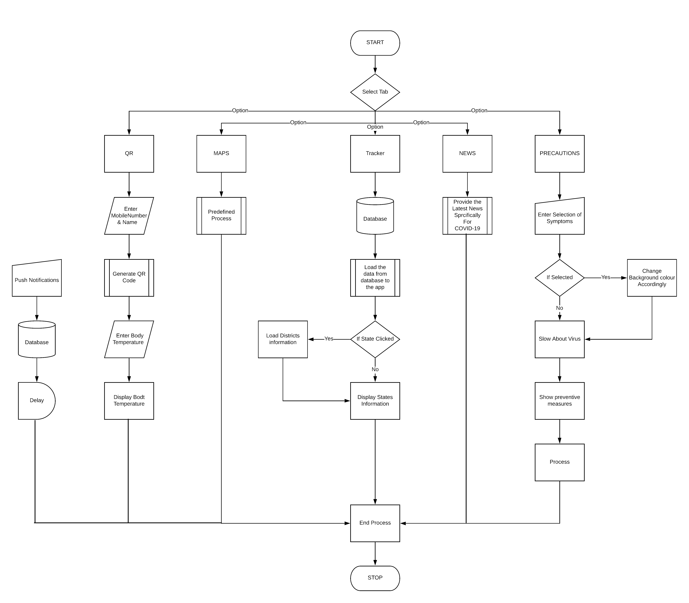
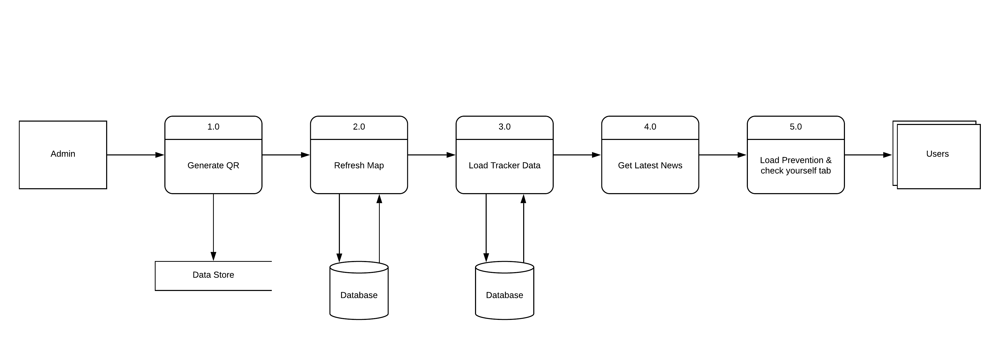

# GoCorona

Description
      
    With the help of this Android application,
    One can get all the necessary details and news regarding the pandemic.
    In this application named as GoCorona, we have created 5 horizontal tabs named as QR, Maps, Tracker, News & Precations.
    The QR section of the tab has details such as the information about the user his mobile number and his name,
    so one can scan the Qr code and get all the details the idea behind this was that if this person has to visit any
    mass gathering place such as a mall, Station ect, so he has to show his details there and the is also an input for 
    body temperature which will be filled by the user when the person in charge who is checking everyone 
    will provide him with the details, this is done in order to maintain a safe distance and 
    no contact between the people so as to prevent the further spread of it. 
    The Maps section of the Tab consists of a map view with red zones 
    as danger zones so that people if traveling somewhere can know the situation 
    about any area beforehand and prevent people from going outside and to make them aware 
    that they have to be extra precautive. The Tracker section consists of a tabular representation 
    of the lastest information such as the number of confirmed cases, Active cases, 
    Recovered & deaths As per state and on clicking the specific state information about specific districts of the same,
    It also contains graphs and other necessary information. The News section contains all the latest news specifically 
    for this application of coronavirus, so as to keep the users up to date with all the latest and true news from around the world.
    The last Tab Preventions one consists of all the information about corona, myth busters, and many more images, 
    It also consists of a check yourself section by which you can check yourself for corna if you have some of the symptoms 
    the background colour of the tab will be changed accordingly, With indications such as 
    Green-Safe, Yellow-Not Sure, Orange-Can Be, Red-Confirm so that the individual can check himself 
    if he has some symptoms and be sure about it, So that he can Home QUARANTINE himself 
    then and there and contact health officials about this case. 
    The Application also contains a notification feature so the Admin can push all the important information 
    about the lockdowns, Or update about the pandemic, Important news, Quick actions and many more.
    
Hardware & Software Requirements

      HARDWARE
        Ram 500mb and more
        Rom 2 Gb+
      
      SOFTWARE
        ANDROID 4.4+
        
        
Process Flow Diagram
  

Data Flow Diagram
       
